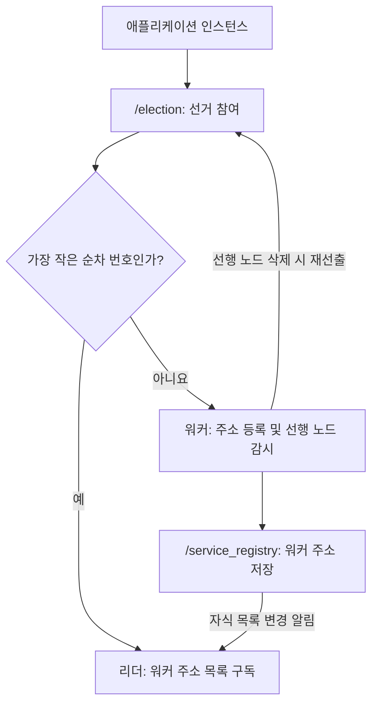

<div align="center">

# 🔎 Service Registry & Discovery

**Apache ZooKeeper 기반 서비스 등록·탐색과 리더 선출**

노드의 참여와 이탈을 감지하고, 리더가 워커 주소 목록을 갱신하는 분산 시스템 실습 프로젝트


[프로젝트 소개](#-프로젝트-소개) · [동작 구조](#-동작-구조) · [실행 방법](#-실행-방법) · [기술 블로그](https://blog.naver.com/pathfinder7777/223535419088)

</div>

---

## 📘 프로젝트 소개

여러 애플리케이션 인스턴스가 실행되는 환경에서는 **어떤 노드가 참여 중인지**, **각 노드의 주소는 무엇인지**, **어떤 노드가 리더인지**를 공유해야 합니다.

이 프로젝트는 Java와 Apache ZooKeeper를 이용하여 다음 동작을 구현합니다.

- **Leader Election** — 순차 번호가 가장 작은 znode를 가진 인스턴스를 리더로 선출합니다.
- **Service Registration** — 워커가 자신의 주소를 ZooKeeper에 등록합니다.
- **Service Discovery** — 리더가 등록된 워커 주소를 조회하고 로컬 목록으로 유지합니다.
- **Change Detection** — Watcher로 노드 삭제와 레지스트리 변경을 감지합니다.
- **Role Transition** — 워커가 리더로 승격되면 자신의 서비스 등록을 제거하고 주소 목록 구독을 시작합니다.

> 서비스 등록·탐색과 리더 선출의 동작 원리를 살펴보는 학습용 구현입니다. 실제 HTTP 서버나 요청 분산 기능은 포함되어 있지 않습니다.

## 🧭 동작 구조



재선출 시에는 기존 선거 znode를 기준으로 순서를 다시 확인합니다. 선거 참여 znode를 매번 새로 만드는 것은 아닙니다.

### ZooKeeper 데이터 구성

| 경로 | 생성 방식 | 저장 내용 및 역할 |
| --- | --- | --- |
| `/election` | 사전 생성하는 Persistent znode | 리더 선출용 부모 경로 |
| `/election/c_…` | Ephemeral Sequential | 각 인스턴스의 선거 참여 및 순서 결정 |
| `/service_registry` | 코드에서 없으면 Persistent로 생성 | 워커 등록용 부모 경로 |
| `/service_registry/n_…` | Ephemeral Sequential | 워커 주소 `http://<hostname>:<port>` 저장 |

**Ephemeral znode는 ZooKeeper 세션에 연결됩니다.** 세션이 종료되거나 만료되면 제거되므로, 강제 종료된 인스턴스의 반영 시점은 세션 상태에 따라 달라질 수 있습니다.

### 이벤트 처리 방식

| 이벤트 | 코드의 동작 |
| --- | --- |
| 인스턴스 시작 | 선거 znode 생성 후 순차 번호 비교 |
| 워커로 결정 | 주소 등록 및 바로 앞 순서의 znode 감시 |
| 감시 중인 선행 znode 삭제 | 남은 참여 노드의 순서를 확인하여 재선출 |
| 워커 등록·삭제 | 리더가 주소 목록을 다시 읽고 Watch 재등록 |
| 워커 → 리더 전환 | 자신의 레지스트리 항목 삭제 후 변경 구독 시작 |

모든 워커가 리더 znode 하나를 감시하는 대신 **각자 바로 앞 순서의 znode를 감시**합니다. 레지스트리 Watch는 `getChildren()` 호출로 다시 등록하여 이후 변경도 감지합니다.

## 🧩 코드 구성

소스 위치: [`service-registry/src/main/java`](service-registry/src/main/java)

| 파일 | 책임 |
| --- | --- |
| [`Application.java`](service-registry/src/main/java/Application.java) | ZooKeeper 연결, 실행 인자 처리, 선거 시작 및 종료 처리 |
| [`OnElectionAction.java`](service-registry/src/main/java/OnElectionAction.java) | 리더·워커 역할에 따른 등록 및 구독 동작 |
| [`LeaderElection.java`](service-registry/src/main/java/cluster/management/LeaderElection.java) | 선거 참여, 순서 비교, 선행 노드 감시 및 재선출 |
| [`OnElectionCallback.java`](service-registry/src/main/java/cluster/management/OnElectionCallback.java) | 역할 변경 콜백 인터페이스 |
| [`ServiceRegistry.java`](service-registry/src/main/java/cluster/management/ServiceRegistry.java) | 워커 주소 등록·삭제, 목록 조회 및 Watch 처리 |

## 🚀 실행 방법

### 1. 준비 사항

- JDK 17 및 Maven
- `localhost:2181`에서 접속 가능한 ZooKeeper 서버
- 인스턴스별로 실행할 터미널

빌드는 Java 17을 대상으로 하며, Maven에 선언된 **ZooKeeper 클라이언트 의존성은 `3.4.12`**입니다. ZooKeeper 서버는 별도로 준비해야 합니다.

### 2. 선거 경로 생성

ZooKeeper CLI에 접속하여 다음 명령을 실행합니다. 서버가 설치된 환경에 따라 `zkCli.sh` 또는 `zkCli.cmd`를 사용합니다.

```text
create /election ""
ls /
```

`/election`이 이미 있으면 다시 생성할 필요가 없습니다. `/service_registry`는 애플리케이션에서 생성합니다.

> 현재 코드는 `/election`을 자동으로 만들지 않습니다. 이 경로가 없으면 선거 참여 과정에서 `NoNode` 오류가 발생할 수 있습니다.

### 3. 저장소 내려받기 및 빌드

```powershell
git clone https://github.com/path0971/service-registry-discovery.git
cd service-registry-discovery/service-registry
mvn clean package
```

Maven Assembly Plugin이 의존성을 포함한 실행 JAR을 생성합니다.

### 4. 여러 인스턴스 실행

각 터미널에서 `service-registry` 모듈 폴더로 이동한 뒤 하나씩 실행합니다. 첫 번째 인스턴스의 연결과 선출 로그를 확인한 후 나머지를 시작합니다.

**터미널 A**

```powershell
java -jar target/service.registry-1.0-SNAPSHOT-jar-with-dependencies.jar 8080
```

**터미널 B**

```powershell
java -jar target/service.registry-1.0-SNAPSHOT-jar-with-dependencies.jar 8081
```

**터미널 C**

```powershell
java -jar target/service.registry-1.0-SNAPSHOT-jar-with-dependencies.jar 8082
```

인자는 **등록할 주소에 넣는 포트 번호**이며, 생략 시 `8080`을 사용합니다. 이 명령이 해당 포트에 HTTP 서버를 여는 것은 아닙니다.

## 🧪 동작 확인

| 확인 단계 | 관찰할 결과 |
| --- | --- |
| 첫 인스턴스 실행 | 기존 참여 노드가 없는 경우 `I am the leader` 출력 |
| 두 번째·세 번째 인스턴스 실행 | `I am not the leader`, `Registered to service registry` 출력 |
| 리더 터미널 확인 | `The cluster addresses are: [...]`에 워커 주소 표시 |
| 워커 하나 종료 | 해당 세션의 znode가 제거된 후 리더의 주소 목록 갱신 |
| 리더 종료 | 다음 순서의 인스턴스가 리더로 전환하고 남은 워커 주소 조회 |

ZooKeeper CLI에서도 등록 상태를 확인할 수 있습니다.

```text
ls /election
ls /service_registry
```

워커 주소를 확인하려면 두 번째 명령에 출력된 실제 자식 이름을 사용합니다.

```text
get /service_registry/<실제 자식 znode 이름>
```

## ⚙️ 주요 설정

현재 값은 [`Application.java`](service-registry/src/main/java/Application.java)에 정의되어 있습니다.

| 항목 | 현재 값 | 의미 |
| --- | --- | --- |
| ZooKeeper 주소 | `localhost:2181` | 접속 대상 서버 |
| 요청 세션 타임아웃 | `30000 ms` | 클라이언트가 요청하는 세션 타임아웃 |
| 기본 등록 포트 | `8080` | 실행 인자가 없을 때 주소에 사용하는 포트 |
| 등록 호스트명 | `getCanonicalHostName()` | 실행 환경에서 조회한 로컬 호스트명 |

## 📝 구현 범위

- 등록된 주소는 **서비스 메타데이터**이며, HTTP 응답이나 서비스 상태를 검사하지 않습니다.
- 주소 목록 갱신은 레지스트리의 **자식 목록 변경**을 기준으로 합니다. 기존 znode 데이터만 바꾸는 경우를 위한 별도 Watch는 없습니다.
- 현재 연결 상태 처리에서는 `SyncConnected` 이외의 연결 이벤트를 받으면 대기 루프를 깨우고 종료합니다. 자동 재접속·세션 재생성은 별도 구현이 필요합니다.
- znode 생성에는 `OPEN_ACL_UNSAFE`를 사용합니다. 인증·ACL을 적용한 운영 환경 구성은 포함되어 있지 않습니다.

## 📚 관련 학습 기록

구현과 관련된 개념은 아래 기술 블로그에서 확인할 수 있습니다.

**[서비스 등록·탐색 관련 기술 블로그 →](https://blog.naver.com/pathfinder7777/223535419088)**

---

<div align="center">

**Leader Election · Service Registration · Service Discovery**<br>
ZooKeeper의 znode와 Watcher로 살펴보는 분산 시스템의 동작 원리

</div>
